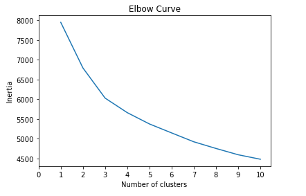

# Myopia Clusters

Lets explore this unsupervised learning on a Myopia Dataset

First we need to process the raw data to fit the machine learning models. K-Mean clustering algorithms is used for exploration. 

## Instructions

This activity is broken down into four parts:

* Part 1: Prepare the Data

* Part 2: Apply Dimensionality Reduction

* Part 3: Perform a Cluster Analysis with K-means

* Part 4: Make a Recommendation

### Part 1: Prepare the Data

1. Read `myopia.csv` into a Pandas DataFrame.

2. Remove the "MYOPIC" column from the dataset.

3. Standardize your dataset so that columns that contain larger values do not influence the outcome more than columns with smaller values.

### Part 2: Apply Dimensionality Reduction

1. Perform dimensionality reduction with PCA. 

2. Further reduce the dataset dimensions with t-SNE and visually inspect the results. To do this, run t-SNE on the principal components, which is the output of the PCA transformation.

### Part 3: Perform a Cluster Analysis with K-means

Create an elbow plot to identify the best number of clusters. 

* Use a `for` loop to determine the inertia for each `k` between 1 through 10.

### Part 4: Make a Recommendation

* Looking at elbow cure we can say that there aren't any highly differentiated cluster. 
* Same can be concluded from the scatter plot generated from the t-SNE features. We can also see that myopic and non-myopic data is blended togethere and are not forming any differentaible cluster.
* Deep learning `Sequential` model would be a better choice for this problem. 